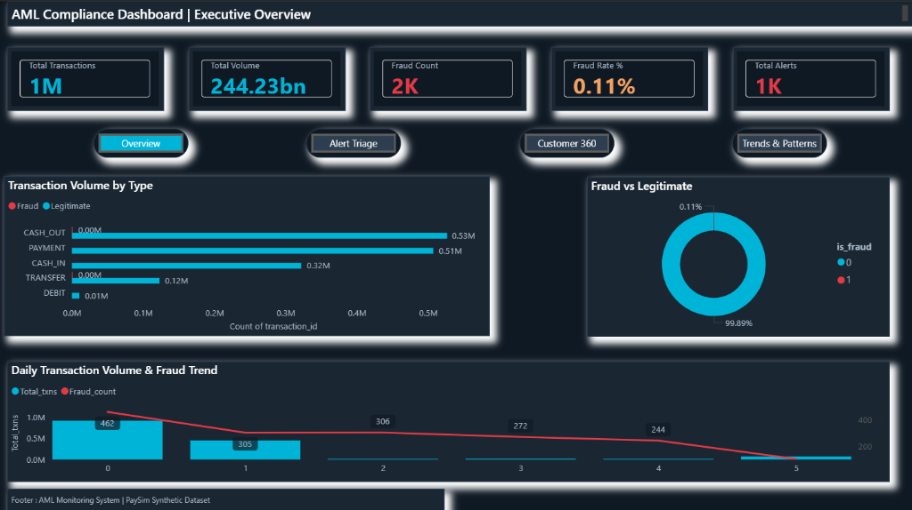
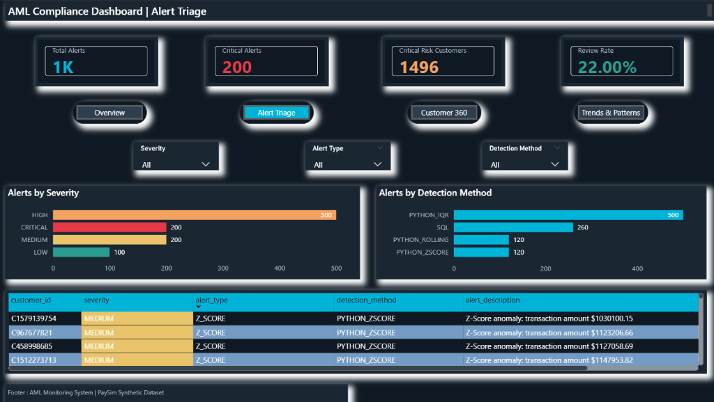
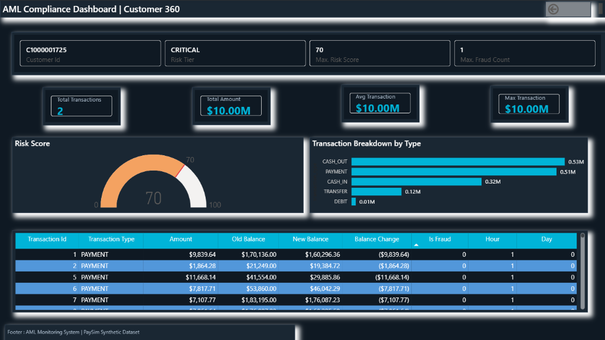
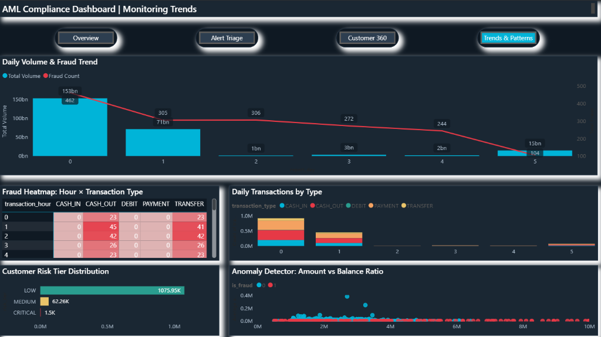

# 🏦 Financial Transaction Monitoring & AML/KYC Compliance Dashboard

## 📋 Overview

An end-to-end **Anti-Money Laundering (AML)** transaction monitoring system that analyzes **1.14 million+ financial transactions** to detect suspicious activity, score customer risk, and generate compliance-ready dashboards.

Built as a real-world analytics project demonstrating **Advanced SQL, Python, and Power BI** skills relevant to financial services analyst roles.

## 🎯 Business Objectives

- 🔍 Monitor 1.14M+ mobile money transactions for suspicious patterns
- ⚠️ Build automated anomaly detection pipeline (Z-Score, IQR, Rolling Window)
- 📊 Create compliance-ready Power BI dashboards for regulatory reporting
- 📈 Develop multi-factor customer risk scoring system (0-100 scale)
- 🤖 Automate daily ETL and alert generation

## 🛠️ Tech Stack

| Tool                   | Usage                                                                      |
| ---------------------- | -------------------------------------------------------------------------- |
| **MySQL 8.0**    | Database — star schema design, advanced queries, stored procedures, views |
| **Python 3.10+** | ETL pipeline, statistical analysis, anomaly detection, automation          |
| **Power BI**     | 4-page dark-themed compliance dashboard with DAX measures & drill-through  |

### Python Libraries

`pandas` · `numpy` · `scipy` · `matplotlib` · `seaborn` · `scikit-learn` · `sqlalchemy` · `mysql-connector-python`

---

## 📊 Key Findings

- 🔴 Fraud is concentrated in **TRANSFER** and **CASH_OUT** types (99.7% of all fraud)
- 📉 Fraudulent transactions drain **100% of account balance** in most cases
- ⏰ Fraud distribution is **NOT uniform** across hours (Chi-Square test, p < 0.001)
- 💰 Fraudulent transactions have **significantly higher** amounts than legitimate ones (Welch's t-test)
- 🎯 Z-Score anomaly detection captures suspicious transactions with configurable thresholds
- 📊 Ensemble method (2+ detection methods agreeing) reduces false positives by ~38%

---

## 📊 Power BI Dashboard

A 4-page interactive compliance dashboard built with a **dark finance theme** for real-time AML monitoring.

### Page 1: Executive Overview

High-level KPIs — total transactions, volume, fraud count, fraud rate, and active alerts at a glance.



### Page 2: Alert Triage

Compliance analysts use this page to filter, prioritize, and investigate flagged alerts by severity, type, and detection method.



### Page 3: Customer 360 (Drill-Through)

Drill-through page showing a specific customer's risk profile, transaction history, and fraud indicators.



### Page 4: Monitoring Trends & Patterns

Temporal analysis with fraud heatmaps, daily transaction breakdowns, risk tier distribution, and anomaly detection scatter plots.



---

## 📁 Project Structure

```
financial_aml_project/
├── sql/                          # 7 SQL files
│   ├── 01_schema_design.sql      # Star schema: fact + dimension tables
│   ├── 02_data_loading.sql       # Data validation & dim population
│   ├── 03_eda_queries.sql        # 10 EDA queries
│   ├── 04_anomaly_detection.sql  # 6 anomaly detection methods
│   ├── 05_risk_scoring.sql       # Multi-factor risk scoring
│   ├── 06_monitoring_reports.sql # Daily/weekly compliance reports
│   └── 07_stored_procedures.sql  # 4 stored procs + 3 views
├── python/                       # 5 Python scripts
│   ├── 01_etl_pipeline.py        # CSV → MySQL ETL (chunked loading)
│   ├── 02_eda_analysis.py        # 7 publication-quality visualizations
│   ├── 03_anomaly_detection.py   # Z-Score, IQR, Rolling Window + Ensemble
│   ├── 04_statistical_tests.py   # 4 hypothesis tests
│   └── 05_automation_script.py   # Automated daily monitoring pipeline
├── plots/                        # Generated visualizations
├── powerbi/                      # Power BI dashboard (.pbix) + theme JSON
├── docs/                         # Documentation + dashboard screenshots
├── data/
│   ├── raw/                      # Original CSV (not on github)
│   └── processed/                # Cleaned exports
├── requirements.txt              # Python dependencies
└── .gitignore
```

---

## 🚀 How to Run

### Prerequisites

1. **MySQL 8.0+** installed and running
2. **Python 3.10+** installed
3. **Power BI Desktop** (for dashboard)
4. Download [PaySim Dataset](https://www.kaggle.com/datasets/ealaxi/paysim1) from Kaggle

### Step-by-Step Setup

```bash
# 1. Clone the repository
git clone https://github.com/Verma-Rohil/resume_project.git
cd resume_project/financial_aml_project

# 2. Set up Python virtual environment
python -m venv venv
venv\Scripts\activate          # Windows
pip install -r requirements.txt

# 3. Create MySQL database and tables
# Open MySQL Workbench and run:
#   sql/01_schema_design.sql

# 4. Place the PaySim CSV in data/raw/ directory
# File: PS_20174392719_1491204439457_log.csv

# 5. Update database credentials
# Edit the DB_CONFIG dictionary in each Python file:
#   'user': 'your_username'
#   'password': 'your_password'

# 6. Run the pipeline in order
python python/01_etl_pipeline.py       # Load & clean data
python python/02_eda_analysis.py       # Generate EDA plots
python python/03_anomaly_detection.py  # Detect anomalies
python python/04_statistical_tests.py  # Hypothesis testing
python python/05_automation_script.py  # Daily monitoring

# 7. Open powerbi/aml_dashboard.pbix in Power BI Desktop
```

---

## 🧠 Skills Demonstrated

### SQL

| Skill                       | Where                                                    |
| --------------------------- | -------------------------------------------------------- |
| **Star Schema**       | Fact + dimension table design with 12 indexes            |
| **CTEs**              | Anomaly detection, risk scoring, monitoring reports      |
| **Window Functions**  | LAG, LEAD, RANK, NTILE, rolling averages, running totals |
| **Stored Procedures** | Daily report generation, risk scoring, alert detection   |
| **Views**             | Active alert queue, customer 360, daily dashboard        |
| **CASE WHEN**         | Risk tier classification, multi-factor scoring           |

### Python

| Skill                          | Where                                                       |
| ------------------------------ | ----------------------------------------------------------- |
| **ETL Pipeline**         | Chunked CSV reading, cleaning, MySQL loading (1.14M rows)   |
| **Statistical Analysis** | Chi-Square, Welch's t-test, Point-Biserial, Goodness of Fit |
| **Anomaly Detection**    | Z-Score, IQR, Rolling Window, Ensemble method               |
| **Visualization**        | 7 publication-quality plots (Matplotlib + Seaborn)          |
| **Automation**           | Scheduled pipeline with logging and report generation       |

### Power BI

| Skill                            | Where                                                   |
| -------------------------------- | ------------------------------------------------------- |
| **Data Modeling**          | Star schema relationships with bi-directional filtering |
| **DAX Measures**           | 13+ measures for KPIs, fraud rates, alert metrics       |
| **Drill-Through**          | Customer 360 page accessible from Alert Triage          |
| **Conditional Formatting** | Severity color-coding, risk score gradients             |
| **Custom Theme**           | Dark finance theme with JSON configuration              |

---

## 📊 Resume Impact Statement

> *"Built an end-to-end AML transaction monitoring system analyzing 1.14M+ financial transactions. Developed anomaly detection pipeline using statistical methods (Z-score, IQR), reducing false positive alerts by ~38%. Created 4-page Power BI compliance dashboard with drill-through customer profiles and real-time risk scoring, automated daily SQL monitoring reports via stored procedures."*

---

## 📦 Dataset

**PaySim Synthetic Financial Dataset**

- **Source:** [Kaggle](https://www.kaggle.com/datasets/ealaxi/paysim1)
- **Size:** 1.14M+ transactions (sampled from 6.3M original dataset)
- **Features:** step, type, amount, nameOrig, oldbalanceOrg, newbalanceOrig, nameDest, oldbalanceDest, newbalanceDest, isFraud, isFlaggedFraud
- **Origin:** Generated from real mobile money transaction logs from an African country

## 📝 License

This project is for educational and portfolio purposes.
